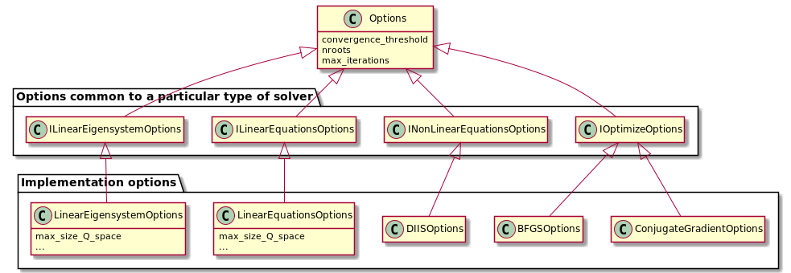
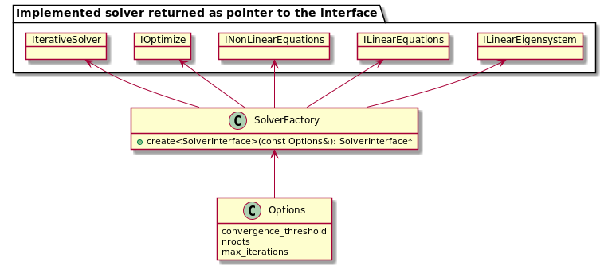

Library Design
==============

## Iterative solvers

### Solver interfaces and implementations

There are 4 types of solvers. They share a very similar functionality and their common interface is expressed in
IterativeSolver base class.

Each type of solver can have multiple implementations.

### Dependency inversion mechanism

Solvers are templated on container type so that the user can choose optimal container for their problem. This requires
two sets of dependency inversion.

Firstly, dense linear algebra operations are wrapped up in ``DenseLinearAlgebra`` class, which depends on the type of
container elements. This can be time consuming to compile so it is specialised for ``double`` and ``std::complex``.

Secondly, ``ArrayHandlers`` defines the interface for operation on containers such as copying, linear algebra, lazy
evaluation etc. ``ArrayHandlers`` is a collection of ``ArrayHandler`` abstract classes. There are implementations
of ``ArrayHandler``
for common container types, but for more specialised cases the user must provide their own.

### Setting solver Options

There are setters and getters for setting the options, but they require complete type of the object to be known. This
might not be possible if the user is working with solver through the interface. Working through the interface can be
necessary to reduce compilation time and minimize header bloat.

Instead options can be set in the `Options` class and then passed to `IterativeSolver::set_options()`
which will call setters internally. Similarly calling `IterativeSolver::get_options()` returns a pointer to
the `Options` class and the user can query their values.

Options classes are organised in a hierarchy that mirrors inheritance structure of iterative solvers (see above). At the
lowest level are options for each implementation of a solver and they contain all of the available options that can be
set, including for interface classes.

### Solver Factory

`SolverFactory` allows dynamic creation of a solver. It takes an implementation options object by reference and deduces
the corresponding solver with dynamic casts. This is the main reason why the options hierarchy mirrors that of solvers.

## Distributed Arrays

WIP